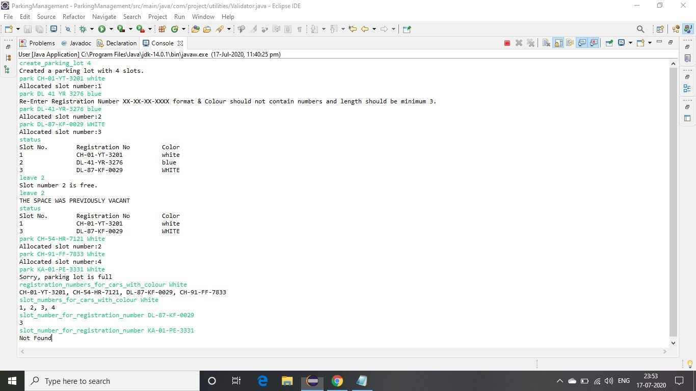
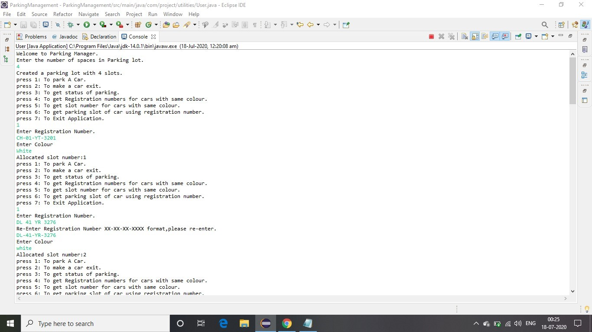
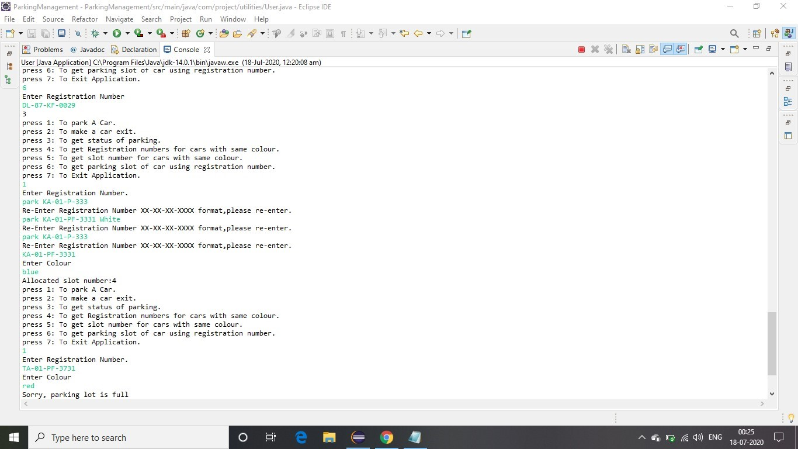
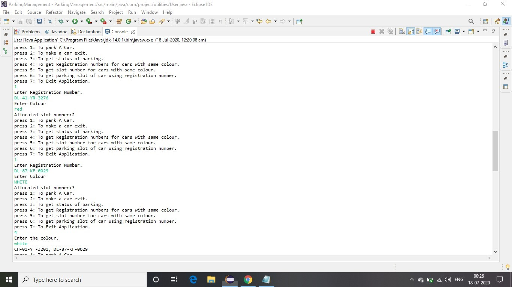
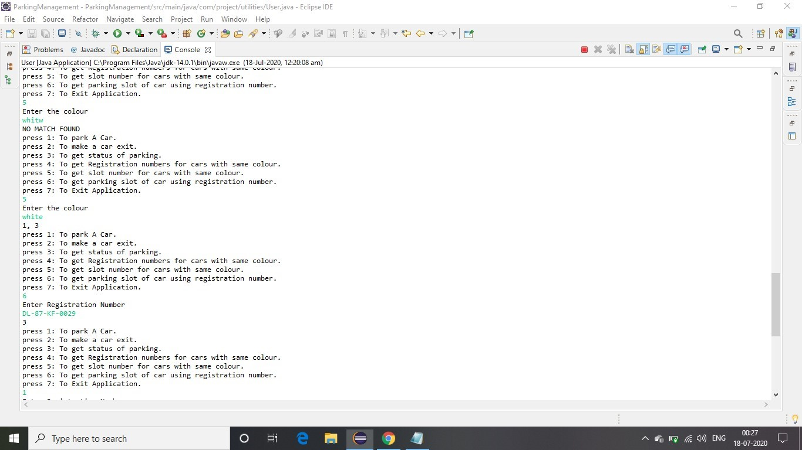
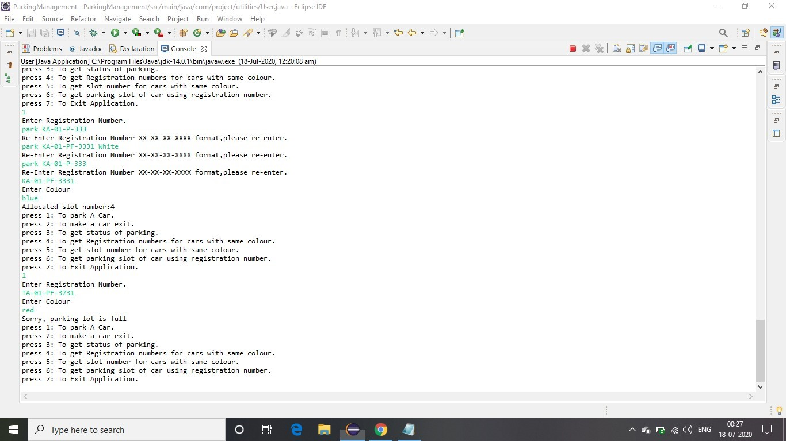

# ParkingManagement 

**INPUT TYPE 1 : 
INPUT STATEMENTS:
create_parking_lot 4
park CH-01-YT-3201 white
park DL 41 YR 3276 blue
park DL-41-YR-3276 blue
park DL-87-KF-0029 WHITE
status
leave 2
status
park CH-54-HR-7121 White
park KA-01-P-333 White
registration_numbers_for_cars_with_colour White
slot_numbers_for_cars_with_colour White
slot_number_for_registration_number DL-87-KF-0029
slot_number_for_registration_number KA-01-P-333**                           

                                                                                   
                                                                           
                                                                                                                                      
                                                                           
**INPUT TYPE 2 :**

                                                                                     

